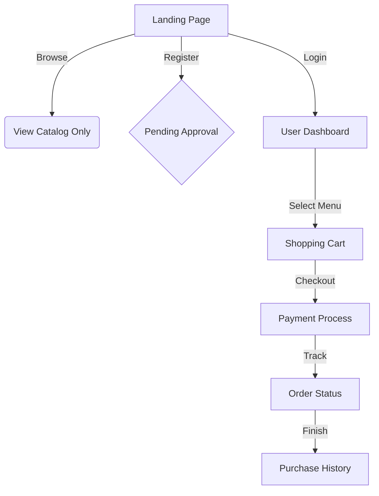

# 🍱 Catering Instansi - Frontend Hub (Portfolio Ready)

> **Solusi Pemesanan Katering Digital untuk Ekosistem Instansi yang Modern, Cepat, dan Responsif.**

Repositori ini merupakan sisi **Frontend** dari proyek *Fullstack Catering*. Dibangun dengan fokus utama pada pengalaman pengguna mobile (*Mobile-First*), sistem ini memungkinkan pelanggan dari berbagai instansi untuk memesan menu harian dengan standar estetika yang tinggi (*Rich Aesthetics*) dan performa yang optimal.

---

## 🚀 Filosofi Teknologi & Desain

### 1. **SvelteKit (High-Performance Framework)**
Dipilih karena pendekatan *Zero-Virtual DOM* yang menghasilkan bundle JavaScript sangat kecil. Hal ini krusial untuk pengguna mobile agar aplikasi tetap gegas meskipun dalam koneksi internet terbatas.

### 2. **Tailwind CSS (Adaptive UI)**
Memungkinkan pembuatan antarmuka yang benar-benar responsif melalui pendekatan *Utility-First*. Desain diarahkan ke gaya *Modern Clean* yang menonjolkan kelezatan visual produk makanan.

### 3. **Security & Access Guard**
- **RBAC (Role-Based Access Control)**: Implementasi *Route Guarding* menggunakan SvelteKit Hooks untuk memastikan modul Admin/CS tidak dapat diakses oleh pengguna biasa.
- **CSRF & XSS Protection**: Proteksi bawaan SvelteKit terhadap serangan *Cross-Site Request Forgery* dan *Cross-Site Scripting*.
- **Secure Sessions**: Token sesi disimpan dalam **HttpOnly Cookies** untuk mencegah pencurian token melalui JavaScript (Client-side).
- **Graceful Error Handling**: Sistem feedback user yang aman tanpa membocorkan detail teknis server saat terjadi error.

---

## 🛠️ Fitur Modular (Frontend Focus)

### 🧺 Modul User / Customer
- **Katalog Menu Harian**: Navigasi menu yang tersedia di tanggal berjalan dengan indikator stok real-time.
- **Persistent Cart**: Keranjang belanja yang tetap tersimpan (LocalStorage) meskipun halaman dimuat ulang.
- **Order Tracking**: Visualisasi progres pesanan (Pending -> Diproses -> Dikirim -> Selesai).
- **Digital Receipt (PDF)**: Antarmuka untuk melihat dan mengunduh bon pembayaran dalam format termal.

### 🌐 Modul Public
- **Landing Page**: Informasi *branding* instansi katering, panduan pemesanan, dan FAQ.
- **Self-Registration**: Alur pendaftaran mandiri yang intuitif dengan pilihan kategori Instansi/Umum.

---

## 📐 Alur Navigasi (UI Flow)



---

## 📂 Struktur Proyek
Untuk detail daftar pengerjaan atomik (Front-end), silakan merujuk ke:
- [Checklist Frontend: Public](../modules/public/FRONTEND.md)
- [Checklist Frontend: User](../modules/user/FRONTEND.md)

---

## 🚀 Menjalankan Proyek Secara Lokal

1. Clone repositori ini.
2. Jalankan `npm install`.
3. Jalankan server pengembangan:
   ```bash
   npm run dev
   ```
4. Akses melalui `http://localhost:5173`.

---
*Proyek ini dirancang sebagai bagian dari sistem katering terpadu. Lihat [Pusat Kontrol Proyek](../README.md) untuk gambaran sistem secara keseluruhan.*
